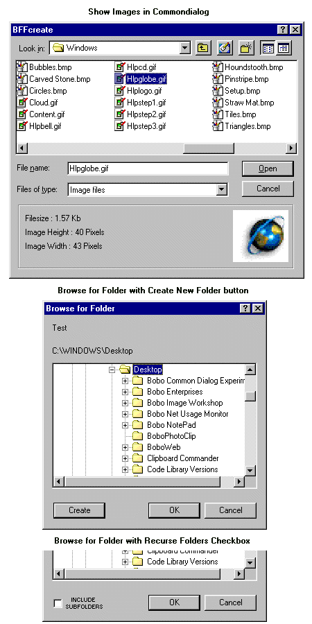



## CommonDialog and Browse for Folders Plus

### Description

Browse for Folders Dialog with 'Create New Folder' button and

'Include Subfolders' checkbox. CommonDialog with image previews.

Both these controls are updated versions of functionality included

in some of my previous submissions. Now Win 2K compliant. Please vote if you like it.
 
### More Info
 

             |
---                |---
**Submitted On**   |2001-04-07 06:40:16
**By**             |[MrBobo](https://github.com/Planet-Source-Code/PSCIndex/blob/master/ByAuthor/mrbobo.md)
**Level**          |Intermediate
**User Rating**    |4.9 (68 globes from 14 users)
**Compatibility**  |VB 6\.0
**Category**       |[Files/ File Controls/ Input/ Output](https://github.com/Planet-Source-Code/PSCIndex/blob/master/ByCategory/files-file-controls-input-output__1-3.md)
**World**          |[Visual Basic](https://github.com/Planet-Source-Code/PSCIndex/blob/master/ByWorld/visual-basic.md)
**Archive File**   |[CommonDial18020462001\.zip](https://github.com/Planet-Source-Code/mrbobo-commondialog-and-browse-for-folders-plus__1-22192/archive/master.zip)

